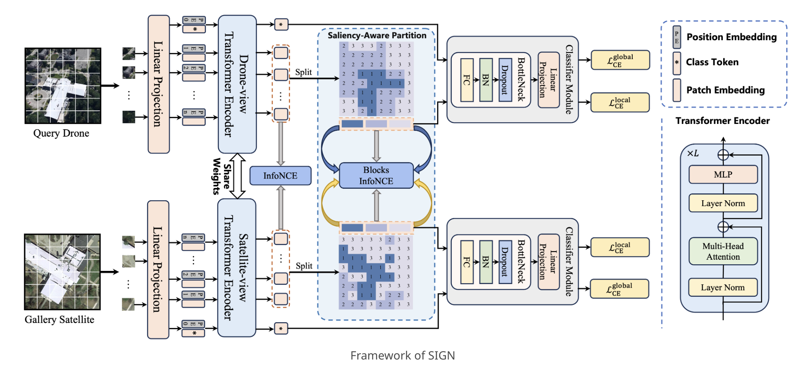

# SIGN: Saliency-Aware Integrated Global-Local Network for Cross-View Geo-Localization

[](https://ieeexplore.ieee.org/abstract/document/11242995)
[](https://ziqianmo.github.io/sign.github.io/)
[](https://2025.ieeeigarss.org/)

This repository contains the official PyTorch implementation of **SIGN: Saliency-Aware Integrated Global-Local Network for Cross-View Geo-Localization**.

SIGN is designed for cross-view geo-localization and performs image retrieval between satellite and drone views. This codebase supports training and evaluation on University-1652 and SUES-200.

## Framework



## Project Structure

```text
.
├── train_university.py      # Train on University-1652
├── eval_university.py       # Evaluate on University-1652
├── train_sues200.py         # Train on SUES-200
├── eval_sues200.py          # Evaluate on SUES-200
└── sign/
    ├── dataset/             # Dataset loaders and SUES-200 split helper
    ├── dinov2/              # DINOv2 model construction
    ├── evaluate/            # Retrieval evaluation
    ├── loss/                # InfoNCE, block losses, triplet loss
    ├── model.py             # Main model wrapper
    ├── trainer.py           # Training and prediction loops
    └── transforms.py        # Image augmentation utilities
```

## Requirements

- Python 3.9.19 
- CUDA-capable GPU is recommended
- PyTorch version should match your CUDA version

Install dependencies:

```bash
pip install -r requirements.txt
```

If you need a specific CUDA build of PyTorch, install PyTorch first from the official selector, then install the remaining packages:

```bash
pip install timm==1.0.9 transformers==4.44.2 albumentations==2.0.5 opencv-python==4.10.0.84 numpy==2.0.2 tqdm==4.66.5 tensorboard==2.18.0 PyYAML==6.0.2
```

## Dataset Preparation

The training and evaluation scripts currently use absolute dataset paths in their `Configuration` classes. Before running, update these paths to match your machine.

### University-1652

Expected folders used by the scripts:

```text
University-Release/
├── train/
│   ├── satellite/
│   └── drone/
└── test/
    ├── query_drone/
    ├── query_satellite/
    ├── gallery_satellite/
    └── gallery_drone/
```

Edit these values in `train_university.py` or `eval_university.py`:

```python
config.query_folder_train
config.gallery_folder_train
config.query_folder_test
config.gallery_folder_test
```

### SUES-200

Expected folders used by the scripts:

```text
SUES-200-512x512/
├── train/
│   └── {150,200,250,300}/
│       ├── satellite/
│       └── drone/
└── test/
    └── {150,200,250,300}/
        ├── query_drone/
        ├── query_satellite/
        ├── gallery_satellite/
        └── gallery_drone/
```

Set `config.altitude` to one of `150`, `200`, `250`, or `300`, and update the dataset paths in `train_sues200.py` or `eval_sues200.py`.

## Training

Train on University-1652:

```bash
python train_university.py
```

Train on SUES-200:

```bash
python train_sues200.py
```

Important configuration options are defined near the top of each training script:

- `model`: timm model name, default is `vit_large_patch14_dinov2.lvd142m`
- `img_size`: input image size
- `epochs`: number of training epochs
- `batch_size`: training batch size
- `gpu_ids` and `device`: GPU selection
- `checkpoint_start`: optional checkpoint path for resuming or fine-tuning
- `model_path`: output folder for checkpoints and logs

## Evaluation

Evaluate University-1652:

```bash
python eval_university.py
```

Evaluate SUES-200:

```bash
python eval_sues200.py
```

Before evaluating, set `checkpoint_start` in the evaluation script to the checkpoint file you want to load.

## Outputs

Training creates a timestamped output directory under `model_path`, containing:

- `train.py`: a copy of the training script used for the run
- `log.txt`: console log
- model checkpoint files

## Notes

- Pretrained timm/DINOv2 weights may be downloaded automatically on first use.

## Citation

If you find this project useful, please cite:

```bibtex
@inproceedings{mo2025sign,
  title={SIGN: Saliency-Aware Integrated Global-Local Network for Cross-View Geo-Localization},
  author={Mo, Ziqian and Sun, Yuxi and Xu, Meng and Jia, Sen},
  booktitle={2025 IEEE International Geoscience and Remote Sensing Symposium (IGARSS)},
  pages={6296--6300},
  year={2025},
  doi={10.1109/IGARSS55030.2025.11242995}
}
```
